---
title: "武汉市疫情预测分析"
subtitle: "中期报告"
author: "管晓倩 王瑶 杨洁 张莉 "
date: "2020年05月15日"
output:
  xaringan::moon_reader:
    css: [default, zh-CN.css]
    lib_dir: libs
    nature:
      highlightStyle: github
      highlightLines: true
      countIncrementalSlides: false
---


## **展示内容**


### 1.绪论


### 2.描述统计


### 3.武汉市初期潜伏患者及再生数估计


### 4.基本SEIR模型的应用与结果

---

## 1. 绪论
## **1.1背景和目的**

## **1.2文献综述**

## **1.3数据来源**

## **1.4模拟退火算法**


---
## **1.1背景和目的**

&emsp;&emsp;2019年12月，湖北武汉陆续发现多例新型冠状病毒肺炎（coronavirus disease 2019,COVID-19），因病毒显著的人传人特性致使其伴随着高度且密集的人口流动迅速蔓延，构成了全球突发公共卫生事件。为控制疫情，1月23日武汉市“封城”，离汉通道关闭，全国各省市相继启动突发公共卫生事件Ⅰ级应急响应，春节假期延长，部分社会活动停止。                         

&emsp;&emsp;截至2020年5月12日24时，我国累计确诊病例82926例，治愈出院78189例，死亡达4633例。疫情的爆发，除了疫情自身所带来的疾病损害、病例死亡外，还会引起极大的社会恐慌，并造成巨大的经济损失，严重威胁人类健康与社会发展。

&emsp;&emsp;本次研究主要利用SEIDC模型和SEIR模型对武汉新冠病毒的疫情发展进行建模和预测。
  

---
## **1.2文献综述**

[1]曹盛力,冯沛华,时朋朋.修正SEIR传染病动力学模型应用于湖北省2019冠状病毒病(COVID-19)疫情预测和评估[J].浙江大学学报(医学版),2020,49(02):178-184.

&emsp;&emsp;论文以2020年1月23日至2月24日的湖北疫情数据为依据，拟合得到了新建立的修正SEIR模型的动力学参数，对湖北疫情进行分析，评估防控隔离和集中收治等措施对疫情发展的影响。

[2]蔡洁,贾浩源,王珂.基于SEIR模型对武汉市新型冠状病毒肺炎疫情发展趋势预测[J].山东医药,2020,60(06):1-4.

[3]Prediction of the COVID-19 outbreak based on a realistic stochastic model.

  
---

## **1.3数据来源**

国家卫生健康委员会（http://www.nhc.gov.cn/）

湖北省卫生健康委员会—通知公告（http://wjw.hubei.gov.cn/fbjd/tzgg/）

武汉市卫生健康委员会—防控要闻（http://wjw.wuhan.gov.cn/ztzl_28/fk/flfg/）

武汉市1月20—4月30的数据，包括累计确诊人数，累计治愈人数和累计死亡人数。   

还有部分实时更新数据来自：https://github.com/839Studio/Novel-Coronavirus-Updates

---
## **1.4模拟退火算法**

“退火”，在热力学上指物体逐渐降温的物理现象。

温度降低→能量状态降低→最低能量状态

模拟退火算法是一种随机搜索方法，适用于解决大规模组合优化问题。寻找问题的最优解（最值）类似寻找系统的最低能量状态。
 

&emsp;&emsp;爬山算法每次从当前解的临近解空间中选择一个最优解作为当前解，直到达到一个局部最优解。爬山算法实现很简单，其主要缺点是会陷入局部最优解，而不一定能搜索到全局最优解。

&emsp;&emsp;模拟退火算法的搜索过程引入了随机因素。模拟退火算法以一定的概率来接受一个比当前解更差的解，因此有可能会跳出这个局部的最优解，达到全局最优解。
---

我们可以看图理解，求这个函数最大值


经典应用实例：旅行商问题，有N个城市，要求从其中某个问题出发，唯一遍历所有城市，再回到出发的城市，求最短的路线。


---

## 2.描述统计
## **2.1各地区线图**

## **2.2疫情动态地图**

## **2.3经济变化趋势**


---
## **2.1各地区线图**
全国趋势图：https://app.flourish.studio/visualisation/2387430/edit

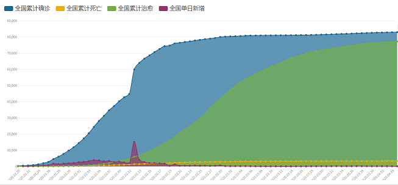

---
&nbsp;

&nbsp;

湖北省趋势图：https://app.flourish.studio/visualisation/2387536/edit

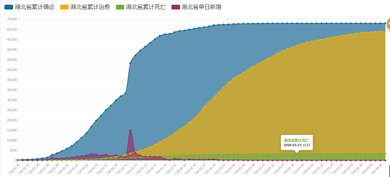

---


武汉市趋势图：https://app.flourish.studio/visualisation/2387587/edit

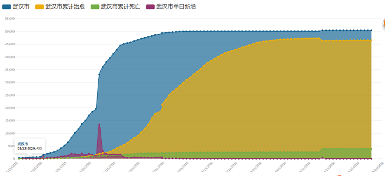

&emsp;&emsp;从全国，湖北省，以及武汉市三个不同等级区域的趋势图对比发现基本趋势是一致的，因为全国的大部分病例都集中在湖北，湖北病例又最多发生在武汉。所以对武汉市做疫情预测分析是具有实际意义的。从图中可以看出，在二月二十日之前，确诊病例增长的速度是较快的，基本上是呈一个陡坡式增长。至三月初，增长趋势开始显著减缓。三月初以后，基本趋于缓和。同时，图中所示拐点皆为二月十二日，当日全国新增15152例，其中武汉市有13436名。由于当日将确诊标准由核酸检测换为核磁CT，确诊速度大大提高，所以新增数目暴增。

---
箱线图展示各区域单日确诊新增和单日死亡新增如下箱线图所示：https://app.flourish.studio/visualisation/2377713/edit

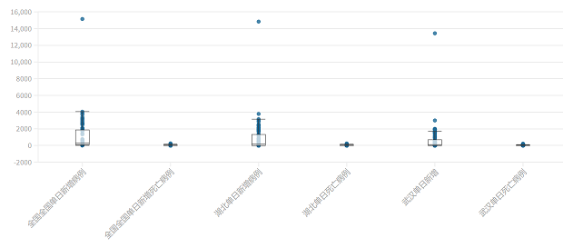

从图中可知：武汉市单日新增最高为13436例，中位数取整为112例；武汉市最高单日新增死亡病例为216例，中位数为20例。

---
## **2.2疫情动态地图**
下面可以从全国各省市的动态地图观察各省市的增长变化趋势：
https://preview.flourish.studio/2341446/HtIq4WA1SCvXvXU5iV3TXvFL2_79YorhEtm3xd0F0T2yXeekMnWrbpJCP4twWb0t/

图中所展示的增长速度与前面的线形图基本也是一致的。截止四月三十日，全国除湖北以外确诊病例最多的分别是广东，河南，浙江，湖南和安徽。
利用Pythonh绘制全国热力图，如图所示：

<div  align="center">    

</div>

---
&nbsp;

&nbsp;

<div  align="center">    
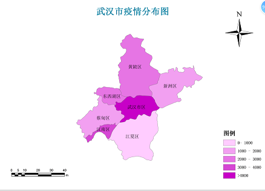
</div>


&emsp;&emsp;武汉市各区感染情况如图所示，可以看出，武汉市中心城区感染情况最为严重，此地最靠近疫情初次爆发地华南海鲜市场。江夏区情况最轻。

---

## **2.3经济变化趋势**
&emsp;&emsp;由于新冠肺炎疫情的蔓延，各省市都相继采取了封城，停工，隔离等措施，基本停止了必需品生产以外的经济活动，经济陷于停滞。
https://preview.flourish.studio/2376910/SDpTGyMHj-8xK7lv-NLgl3Z1ZZmP0Iz46b5kRDO-aFqhBAB4O9zVR3-HoUbcD18r/
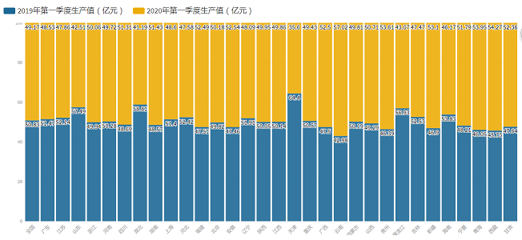
&emsp;&emsp;&emsp;&emsp;从2019年第一季度生产值和2020年的对比图来看，大部分省市2020年的GDP水平都低于上年同季度，其中湖北省下降的的比例最为显著。根据地区生产总值统一核算结果，2020年一季度，武汉市GDP按可比价格计算，比上年同期下降40.5%。其中，第一产业增加值下降36.4%;第二产业增加值下降45.4%;第三产业增加值下降37.7%。

---
##**3.武汉市初期潜伏患者及再生数估计**

##**3.1研究背景**

##**3.2模型搭建**

##**3.3代码展示及结果**

##**3.4模型局限与展望**

##**3.5后续工作**


---

## **3.1研究背景**

&emsp;&emsp; 在传染病学领域，建模评估和预测病毒的传播路径、速率等对于疫情的控制非常重要。在经典的传染病学模型中，R0值常被用来描述疫情的传染速率，可以反映传染病爆发的潜力和严重程度。                       

&emsp;&emsp;R0指的是基本再生数,表示一个病例进入到易感人群中，在理想条件下可感染的二代病例个数。如果 R0 大于 1，那么这种传染病就可以传遍整个人群；而 R0 小于 1 的传染病，则趋于消失。

&emsp;&emsp;在初期疫情的研究中，国内外专家都给出了关于新型冠状病毒的传染速率结果。其中，英美研究团队的结果表明，新型冠状病毒的 R0 值为 3.8，而国内团队给出的数据是 6.47。
---

## **3.2模型搭建**

&nbsp;

模型的目的：估计R0和1月16日的潜伏期感染人数

思路参考：https://github.com/JacksonWuxs/19nCoV-SEIR-Estimation

模型假设：每期新增感染者=α1*潜伏者+α2*确诊患者，所以每一期新增的患者数都都与未感染人数无关。这也是与后面SEIR模型的不同之处。

---

&nbsp;

&emsp;&emsp;模型主要仿照SEIR传染病模型并按照2019-nCoV病毒的传播特性进行了修改。先划分出5个类别的人群，分别为可能感染该病的健康人员（Susceptible, S),潜伏期患者（Exposed,E),确诊患者(Infected,I),死者（Dead,D）和治愈患者（C）。潜伏期患者这里是指将来会变得有症状或者将来也没症状。

&emsp;&emsp;这里定义潜伏期患者导致感染的概率为α1，确诊患者导致的感染的概率为 α2，潜伏期患者被确诊的概率为β，确诊患者被治愈的概率为σ，确诊患者死亡的概率为γ 。通过下式的常微分方程组定义五个人群间的转移方程来描述传染病传播情况。 

$$\dfrac{dS}{dt}=-α1*E-α2*I+σ*I$$
$$\dfrac{dE}{dt}=α1*E+α2*I-β*E$$
$$\dfrac{dI}{dt}=β*E-σ*I-γ*I$$
$$\dfrac{dD}{dt}=γ*I$$
$$\dfrac{dC}{dt}=σ*I$$
---
&nbsp;

&nbsp;

&nbsp;

&emsp;&emsp; 由于难以观测到潜伏期患者数量，于是我们尽可能利用已知数据，则定义我们模型的损失函数为如下公式。最后，使用模拟退火算法估计方程中的系数，同时作为基期的潜伏期患者人数难以被观测，选择从0至1100之间以25为间隔，训练了一系列的模型，并最终选择损失最小的作为本研究的最终模型。
$$Loss=\sum_{i=1}^{n}(I_{i}-\hat{I_{i}})^2+\sum_{i=1}^{n}(D_{i}-\hat{D_{i}})^2+\sum_{i=1}^{n}(C_{i}-\hat{C_{i}})^2$$
---

&nbsp;

数据来源：https://github.com/839Studio/Novel-Coronavirus-Updates；

具体数据:设定1月16日为初始状态，使用1月17日到2月11日的累计确诊、治愈、死亡数据。

数据选择原因：

&emsp;&emsp; 1.为什么设定16日为初始呢？答：16日之前的数据残缺较多，14日，15日的数据没有找到。

&emsp;&emsp; 2.为什么不用封城之前的数据？答：因为23日之前的到10日左右能找到的只有6天数据，尝试过但效果不佳，所以决定加入封城之后的数据。

&emsp;&emsp; 3.为什么数据截止到2月11日？答：因为2月12日诊断方式发生了改变，数目激增，用来估计初期的可能不太合适。

&emsp;&emsp; 4.政策措施是怎么区分的？答：当然这段时间之内多多少少存在不同强度的措施，这里只是假设一样。


---


## **3.3代码展示及结果**

```{python，echo=F}     
    #R2是拟合优度，越接近于1越好
    def score(self, initS, initE, initI, initD, initC, Y, plot=False):
        est = self.predict(initS, initE, initI, initD, initC, len(Y))['I', 'D', 'C']
        loss = self._loss(Y['确诊', '死亡', '治愈'].toarray(), est.toarray())
        est.columns = ['确诊', '死亡', '治愈']
        r1 = r2_score(Y['治愈'], est['治愈'])
        r2 = r2_score(Y['死亡'], est['死亡'])
        r3 = r2_score(Y['确诊'], est['确诊'])
        if plot:
            self.plot_predict(Y, est)
            print(' - 平均潜伏期为：%.2f天' % (1.0 / self.P.beta))
            print(' - 病毒再生数：%.2f' % (self.P.alpha1 / self.P.beta + (self.P.alpha2 / self.P.sigma + self.P.alpha2 / self.P.gamma)/ 2))
            print(' - 确诊R2：%.4f' % r3)
            print(' - 死亡R2：%.4f' % r2)
            print(' - 治愈R2：%.4f' % r1)
            print(' - 模型R2：%.4f' % ((r1 + r2 + r3) / 3))
            print(' - 模型总误差：%.4f' % loss)
        return loss, (r1 + r2 + r3) / 3
``` 


---

&nbsp;

```{python，echo=F}
# 9000000是武汉市封城时的人数，用来估计16日的还存在不准确性，人数需要再估计
#截止到1月16日的累计确诊45、治愈2、死亡人数15，0到1100是参考的，可以换成更大的试试
def searchBestParam(seir):
    min_loss, max_r2, best_param, likeli_potential = float('inf'),0.0,None, 0
    for potential in range(0, 1100, 25):
        seir.fit(900000, potential, 45,15,2,train)
        loss, r2 = seir.score(9000000, potential,45,15,2, Y=train, plot=False)
        if loss < min_loss and r2 > max_r2:
            print('潜在患者：%.4f | R2：%.4f | 误差： %.6f' % (potential, r2, loss))
            min_loss, max_r2, best_param, likeli_potential = loss, r2, seir.P, potential
    seir.P = best_param
    seir.score(9000000, likeli_potential, 45,15,2, Y=train, plot=True)
    return seir, likeli_potential

seir, potentials = searchBestParam(SEIDC())
```

    潜在患者：25.0000 | R2：0.7215 | 误差： 15.641650
    潜在患者：50.0000 | R2：0.8146 | 误差： 14.532187
    
---

<div  align="center">    
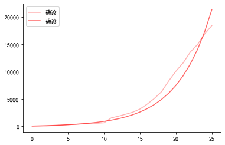
</div>

<center>确诊人数模型得分:0.9572</center>

&nbsp;

<div  align="center">    
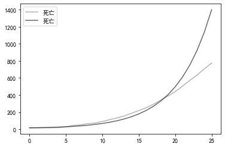
</div>

<center>死亡人数模型得分：0.4907</center>


---
<div  align="center">    
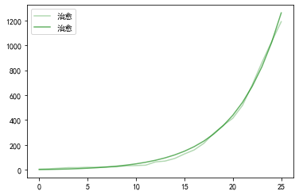
</div>

<center>治愈人数模型得分：0.9960</center>

&emsp;&emsp;模型估计的结果：

&emsp;&emsp;（1）平均潜伏期为：1.51天

&emsp;&emsp;（2）病毒再生基数：6.11

&emsp;&emsp;（3）模型得分：0.8146

&emsp;&emsp;（4）模型总误差：14.5322 

&emsp;&emsp;（5) 武汉市内初始潜伏期患者数：50人


---


## **3.4模型局限与展望**

&emsp;&emsp;1.α具体的值是模型基于已有数据拟合出来的,模型中感染率为常数；

&emsp;&emsp;2.实际上，随着病毒感染的人越来越多，这导致易感人群逐渐减少，实际上R0是会在远期下降的。也就是说，每期新增感染人数应该是一个与易感人群规模、潜伏者和确诊患者的函数。而此模型中，由于在感染初期，武汉市的人口规模并不会成为病毒感染的显著限制之一，所以定义的新增感染人数与易感人群规模无关。

&emsp;&emsp;3.可以把模型的新增患者数修改为一个动态的函数，许多研究已经包含此相关的内容可以进行借鉴。在疫情发展的初期、中期、后期和末期分别拟合模型估计分阶段R0。


---

## **3.5后续工作**

&emsp;&emsp;使用海外检测到的病例数来估计在封城之前在武汉可能发生的病例。现有背景如下：

&emsp;&emsp; 1.武汉封闭时间:1月23日凌晨2点;

&emsp;&emsp; 2.武汉的官方确诊病例在关闭前刚刚超过100例，在1月29日上升到2000例;

&emsp;&emsp; 3.根据2019年的交通数据估计机场人数。

---
# **4.基本SEIR模型**

## **4.1基本SEIR模型介绍**

## **4.2 SEIR模型的实现**

## **4.3 SEIR模型结果**


---

## **4.1基本SEIR模型介绍**


<div  align="center">    
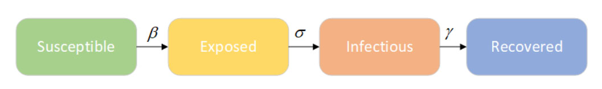
</div>

<div  align="center">    
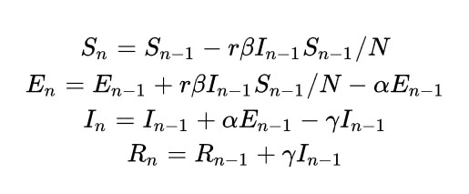
</div>


---

## **4.2 SEIR模型的实现**

<div  align="center">    
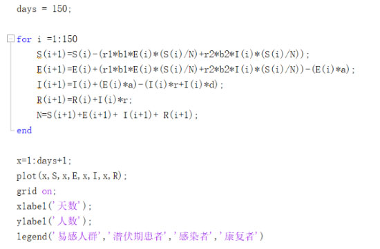
</div>

---

&nbsp;

&nbsp;

&emsp;&emsp;&emsp;&emsp;r1--潜伏期患者每日接触

&emsp;&emsp;&emsp;&emsp;r2--感染者每日接触

&emsp;&emsp;&emsp;&emsp;b1--接触潜伏期患者被感染概率

&emsp;&emsp;&emsp;&emsp;b2--接触感染者被感染概率

&emsp;&emsp;&emsp;&emsp;a---潜伏期患者出现症状的概率

&emsp;&emsp;&emsp;&emsp;r---患者康复概率

&emsp;&emsp;&emsp;&emsp;d---患者死亡概率

---

## **4.3 SEIR模型结果**

<div  align="center">    
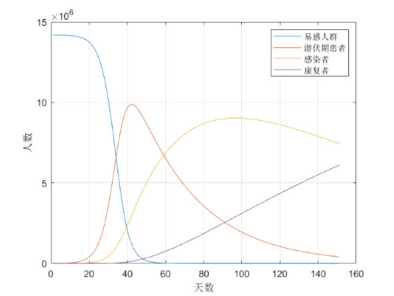
</div>

---

&nbsp; 

&emsp;&emsp;按照真实情况的数据估计r和d：

<div  align="center">    
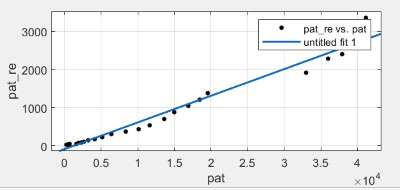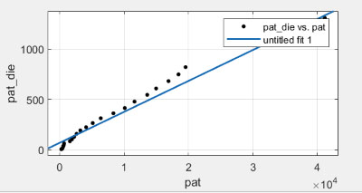
</div>


---

&nbsp; 

<div  align="center">    
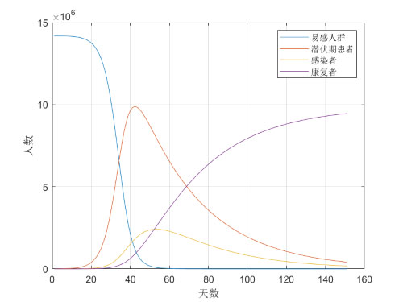
</div>


---

&nbsp;

<div  align="center">    
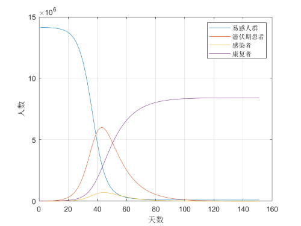
</div>
---

&nbsp;

&nbsp;

&nbsp;

&emsp;&emsp;现在的SEIR模型的建立只是一个基础的理想化的模型，虽然在过程中根据前后情况的不同分成了两部分来考虑，但由于可能存在的超级传播者、前期数据的不完全准确以及政策不断调整变化等原因，由模型得到的结果并不完全准确。

&nbsp;

&emsp;&emsp;我们希望通过考虑更多可能存在影响的因素，进一步加以调整和分析。

---

&nbsp;

&nbsp;

<div  align="center">    

</div>

&nbsp;
<font size=16><center>谢谢大家！<center></font>