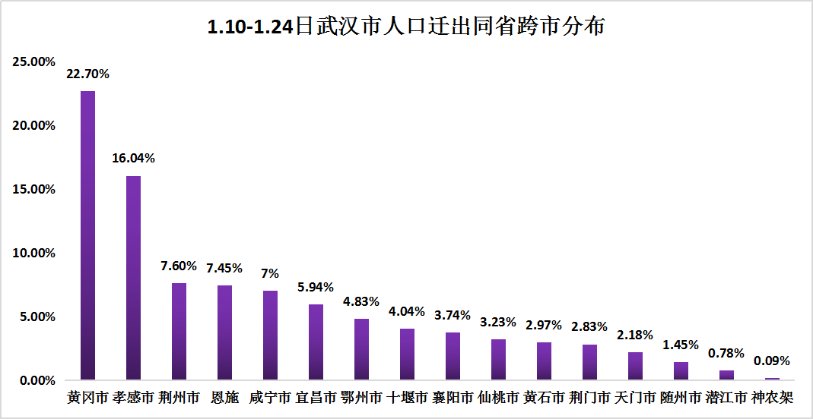
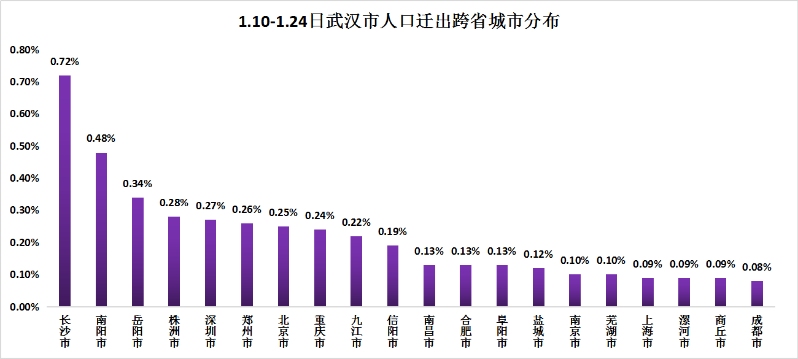
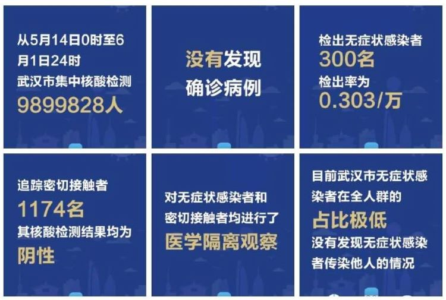

## **目录**

### 1.绪论

### 2.描述统计

### 3.武汉市封城时的感染人数估计

### 4.武汉市疫情高峰预测

### 5.总结
---

## 1. 绪论

## **1.1背景**

## **1.2文献综述**

## **1.3数据来源**

---
## **1.1背景**

---

---
## 国外疫情

&emsp;&emsp;美国约翰斯·霍普金斯大学发布的实时统计数据显示，截至北京时间6月2日6时30分左右，全球累计确诊新冠肺炎病例6242065例，累计死亡374260例。全球疫情持续蔓延，已有53个国家累计确诊均超1万例；13国累计确诊均超10万例；印度和秘鲁等国单日新增均出现最大增幅。
  
---
## 武汉疫情

&emsp;&emsp;截至2020年5月31日24时，武汉市累计报告确诊病例50340例。其中，武昌区，硚口区，江岸区和汉江区确诊病例数较多。6月1日，武汉卫健委对外公布，5月31日，武汉市对6万余人进行了核酸检测，未发现无症状感染者，这是武汉市首次无症状感染者当日新增为零，说明了武汉集中核酸检测排查工作已产生明显成效。

---
## **1.2文献综述**

[1]曹盛力,冯沛华,时朋朋.修正SEIR传染病动力学模型应用于湖北省2019冠状病毒病(COVID-19)疫情预测和评估[J].浙江大学学报(医学版),2020,49(02):178-184.

&emsp;&emsp;论文以2020年1月23日至2月24日的湖北疫情数据为依据，拟合得到了新建立的修正SEIR模型的动力学参数，对湖北疫情进行分析，评估防控隔离和集中收治等措施对疫情发展的影响。

[2]蔡洁,贾浩源,王珂.基于SEIR模型对武汉市新型冠状病毒肺炎疫情发展趋势预测[J].山东医药,2020,60(06):1-4.

[3]Estimating the daily trend in the size of the COVID-19 infected population in Wuhan.

[4]Imperial-College-COVID19-update-epidemic-size-22-01-2020.

[5]韩栋,陈征,陈平雁,Nakamura Tsuyoshi.轮廓似然函数及其应用[J].中国卫生统计,2012,29(04):478-480+483.

[6]Modified SEIR and AI prediction of the epidemics trend of COVID-19 in China under public health interventions.
 

---

## **1.3数据来源**

国家卫生健康委员会（http://www.nhc.gov.cn/）

湖北省卫生健康委员会—通知公告（http://wjw.hubei.gov.cn/fbjd/tzgg/）

武汉市卫生健康委员会—防控要闻（http://wjw.wuhan.gov.cn/ztzl_28/fk/flfg/）

国家统计局（http://www.stats.gov.cn/）

武汉市1月20—6月1日的数据，包括累计确诊人数，累计治愈人数和累计死亡人数。   

还有部分实时更新数据来自：https://github.com/839Studio/Novel-Coronavirus-Updates

---

##**2. 描述统计**

##**2.1各地区线图**

##**2.2武汉市人口流出状况分析**

##**2.3武汉市人口流出对疫情扩散的影响**

##**2.4疫情下的经济变化趋势**

---
## **2.1各地区线图**

---

---

 

&emsp;&emsp;从全国，湖北省，以及武汉市三个不同等级区域的趋势图对比发现基本趋势是一致的，因为全国的大部分病例都集中在湖北，湖北病例又最多发生在武汉。所以对武汉市做疫情预测分析是具有实际意义的。从图中可以看出，在二月二十日之前，确诊病例增长的速度是较快的，基本上是呈一个陡坡式增长。至三月初，增长趋势开始显著减缓。三月初以后，基本趋于缓和。同时，图中所示拐点皆为二月十二日，当日全国新增15152例，其中武汉市有13436名。由于当日将临床诊断也记为确诊，所以出现暴增。

---
## **2.2武汉市人口流出状况分析**

&nbsp;

    

---
&nbsp;

    

---
&nbsp;

    

&emsp;&emsp;根据百度迁徙的数据显示，武汉市流出人口以省内流动为主，约占总流出人口的89.91%，而跨省流出中五成以上流入湖南，河南，广东，安徽，江西五省，基本都是湖北邻省。在省内跨市流动中，武汉市流动人口最多流入黄冈和孝感两市，分别占总流出人口的22.7%和16.04%；跨省跨市流动中，五成以上流入长沙、南阳、岳阳，株洲、深圳、郑州、北京、重阳、九江、信阳十市，长沙和南阳比例最高，分别为0.72%和0.48%。

---
## **2.3武汉市人口流出对疫情扩散的影响**

---

&emsp;&emsp; 由图可知，在省内跨市流动中，人口流入最多的黄冈、孝感两地已经占了省内确诊的三成以上，其他城市的确诊比例基本都与流入比例正向相关。所以说，从湖北省内看，武汉市人口的主要流向地与疫情发展状况高度相关。

&emsp;&emsp;下面通过动态疫情图观察湖北省内的疫情变化情况

---

---
&emsp;&emsp; 而在省外流动中，武汉人口流出与较为严重的省份大致对应，流入人口靠前的省份疫情确诊数量基本也在前列，多集中在东部中部与湖北相邻的省份。而流入比例相对不高的黑龙江等地确诊比例较高，说明该地可能发生二次感染的情况较为严重。利用PYTHON绘制热力图可以更清楚的表示。

    

---

    

&emsp;&emsp;而武汉市内各区感染情况如图所示，可以看出，武汉市中心城区感染情况最为严重，此地最靠近疫情初次爆发地华南海鲜市场。江夏区情况最轻。

---
## **2.4疫情下的经济变化趋势**

    

---
&nbsp;

    

&emsp;&emsp;从2019年第一季度生产值和2020年第一季度的生产值对比图来看，大部分省市2020年的GDP水平都低于上年同季度，其中以湖北省下降的的比例最为显著。根据地区生产总值统一核算结果，2020年一季度，武汉市GDP按可比价格计算，比上年同期下降40.5%。其中，第一产业增加值下降36.4%;第二产业增加值下降45.4%;第三产业增加值下降37.7%。

&emsp;&emsp; 而从雷达图显示的国民经济各方面的指标可以看出，除了实物商品网上销售以外，各个指标都有一定程度的较少，因为减少出门的几率人们会选择网购来购买必须的生活物资。数据显示，一季度按可比价格计算，国内生产总值同比下降6.8%；社会消费品零售总额同比下降19%；全国固定资产投资同比下降16.1%；货物进出口总额下降6.4%。

---

##**3.武汉市封城时的感染人数估计**

##**3.1研究背景**

##**3.2基本假设**

##**3.3理论方法**

##**3.4估计结果**

---
## **3.1研究背景**

&emsp;&emsp; 1.武汉市于2020年1月23日凌晨2时“封城”；

&emsp;&emsp; 2.在“封城”之前，官方的确诊病例数仅是300多，但是在1月29日官方的确诊病例数已经上升到了2000例左右；

&emsp;&emsp; 3.设定1月16日为初始状态，使用1月17日到2月11日的武汉市累计确诊、治愈、死亡数据估计的效果不太好（中期报告）；

&emsp;&emsp; 4.武汉市人口1100万，武汉国际机场的人流量是1900万（来源文献）；

&emsp;&emsp; 5.在2019年11月以及12月的两个月里，每天从武汉国际机场出发的国际旅行平均总次数为3301次（来源文献）；

&emsp;&emsp; 6.截至1月22日，在中国大陆以外发现8例（均从武汉出发）；

&emsp;&emsp; 7.截至1月29日，在中国大陆以外发现67例（均从武汉出发）。

---

## **3.2基本假设**

1.基于流行病的假设：

&emsp;&emsp;（1）估计不包括症状轻微或无症状的病例；

&emsp;&emsp;（2）平均潜伏期6天，从症状出现到检测出的平均时间4天。（来源文献）

&nbsp;

2.基于统计学的假设：

&emsp;&emsp;（1）我们假设武汉市的“海外病例”和“确诊病例”之间存在独立关系;

&emsp;&emsp;（2) 海外检测到的病例数（来自武汉）是服从二项分布的，其中p是任一病例在海外被检测到的概率，这个假设只影响区间估计；

&emsp;&emsp;（3）假设国际旅行者与暴露于新型冠状病毒以及被感染的风险无关。

---

## **3.3理论方法**

研究目的：使用海外检测到的病例数（1月22日，1月29日且来自武汉）,估计封城前武汉的潜在病例数。

1.估计武汉的病例数

（1）总的武汉病例数=海外检测到的病例数/海外发现任一病例的可能性

（2）海外发现任一病例的可能性=国际旅行的每日概率*发现病例的平均时间

（3）国际旅行的每日概率 = 每天从武汉出发的国际旅客(19年11-12月)/武汉国际机场的人流量

（4）发现病例的平均时间=潜伏期的平均时间+从症状出现到检测出的平均时间
---
&nbsp;

2.轮廓似然估计法

&emsp;&emsp;在目标参数呈非正态分布时, 如果计算基于正态分布的WaldCI型置信区间（ 估计值士分位数x 估计值的标准误）来计算模型中某个参数的置信区间将会产生偏差, 尤其在无法计算目标参数的标准误时, 该置信区间也无法计算。而轮廓似然置信区间是基于卡方分布且无需计算标准误,构造置信区间依据的是似然比检验。因此，能够解决参数不服从正态分布和标准误无法计算时置信区间的计算问题。

&nbsp;

3.敏感性分析方法

&emsp;&emsp;最简单和最常见的方法之一是每次更改一个因素(One-at-a-tim，OAT)，以查看这会对输出产生什么影响。OAT通常包括：移动一个输入变量，保持其他变量的基线值，然后以相同的方式对每个其他输入进行重复。将所有其他变量固定在它们的基线值上，通过每次更改一个变量，可以增加结果的可比较性。
---

## **3.4估计结果**

表1 武汉市病例数估计
 

| |基线|更少的人流量|更少的检测时间|
|:------:|:---------:|:----------:|:-------:|:---------:|
|从武汉国际机场出发的每日旅客数|3301|3301|3301|
|武汉国际机场的人流量|19 million|11 million|19 million|
|检测时间|10天|10天|8天|
|基于1月22日数据估计的总病例数|4605|2666|5756|
|基于1月22日估计的总病例数(95%CI)|(2100, 8550)|(1220, 4940)|(2630, 10700)|  
|基于1月29日估计的总病例数|38564|22327|48205|
|基于1月29日估计的总病例数(95%CI)|(30000, 48470)|(17340, 28030)|(37510, 60600)|  

&emsp;&emsp;参数的改变反应了可能的不确定，基于1月29日的数据估计出的结果更具有说服力，因为到1月29日时大多数的来自武汉的境外病例已经被检测到了。考虑到漏报的数据，数据收集时存在问题以及出口筛查可能减少了“海外病例数”,国际旅行者可能更富有，接触的风险更低等问题，这里的估计结果只是一个可能的值。

---
## **4.武汉市疫情高峰预测**

## **4.1 SEIR优化模型**

## **4.2 LSTM模型的应用**
---

## **4.武汉市疫情高峰预测**

    

---

## **4.1 SEIR优化模型**

通过引入迁入In（t）和迁出Out（t）参数来调整原始SEIR方程，以动态展现易感人群S的变动状态。

    

---

修改后的模型表示为：

    

---

为了应用SEIR模型，需要估计参数β和γ。

其中传染系数β是感染者每天接触的人数 （k） 和传染概率 （b） 的乘积，即β= kb。

b=0.05

β1 = 3 x 0.05 = 0.15
β2 = 15 x 0.05 = 0.75

γ=0.16

    

---

## **4.2 LSTM模型的应用**

LSTM模型，是一种循环神经网络（RNN）模型，过去常用于处理和预测各种时间序列问题，可预测一段时间内新增感染人数。

我们整合了参数，包括传染概率b、传染系数β、潜伏率σ、退出率γ等。

由于湖北省目前已实行严格检疫措施，假设2月10日之后湖北省的迁移指数设为零。

---

&nbsp;

&nbsp;

    

---
# **5.总结**

&emsp;&emsp;当前全市疫情防控形势趋于平稳，但每日仍有新发现的无症状感染者，影响在汉、返汉人员正常工作生活的信心。为统筹疫情防控和经济社会发展，为复工复产、复商复市、复学复课营造安全健康的学习、生产、生活环境，市委、市政府在全市范围内进一步加强核酸检测、加快筛查无症状感染者，最大限度地摸清无症状感染者底数，实行全流程严格闭环管理，全力阻断可能的传染源,因此武汉在全市范围内开展了核酸检测，按照“愿检尽检”原则，全市未进行过新冠病毒核酸检测的常住居民和暂住居民均纳入本次检测范围。

---

    

---

定期用消毒剂清洁物品表面，例如厨房桌椅和办公桌等。

学习有关新冠病毒肺炎相关知识，但要确保信息来自地方或国家公共卫生机构、世卫组织网站、地方卫生专业人员等可靠来源。

对大多数人来说，感染新冠病毒后一开始的症状是发烧和干咳，而不是流鼻涕。

在发烧或咳嗽期间避免旅行，如在飞行途中生病，应立即通知机组人员。回家后应立即与医卫人员联系，并告知他们自己去过哪里。

咳嗽或打喷嚏时用衣袖遮挡或使用纸巾。纸巾用完应立即扔进封闭垃圾箱，然后洗手。

60岁以上患有基础疾病者，感染新冠病毒后出现重症的风险可能更高。

---

&nbsp;

&nbsp;

    

&nbsp;

谢谢大家！

